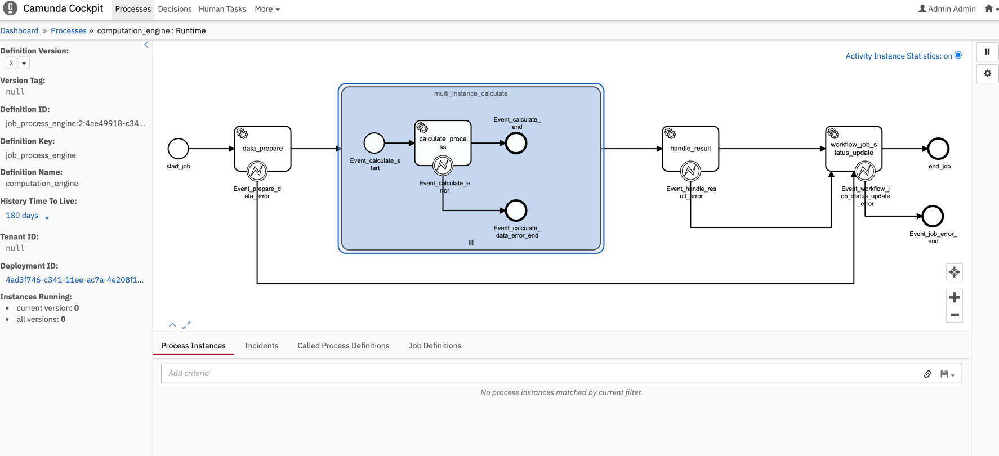

## Camunda demo项目
使用的技术栈: springboot + MongoDB + Camunda-7.16.0 + Mysql8.0

## 启动方式
1. ca-workflow > ca-worker | ca-result

## 测试
1. 提交任务（也可以用postman提交)
```sh
curl --location --request GET 'localhost:8099/workflow/submit-job' \
   --header 'Content-Type: application/json' \
   --data '{
   "jobName":"ceshi-2",
   "jobDesc":"测试",
   "numberOfData":500
   }'
```

获得结果如下：
```json
{
    "jobId": "2024-02-18_17630478165086208",
    "jobName": "ceshi-2",
    "jobDesc": "ahahaha",
    "status": "SUBMITTED",
    "numberOfData": 500,
    "createTime": "2024-02-18 15:37:13"
}
```
2. 进入流程引擎页面

> http://localhost:8099

如下图所示



3. 执行结束后
获取job Result
   
```shell
curl --location 'http://127.0.0.1:8097/result/jobResult?jobId=2024-02-18_17630478165086208'
```
获得结果
```json
{
    "jobId": "2024-02-18_17630478165086208",
    "result": 23912.0,
    "createTime": "2024-02-18 15:37:32",
    "updateTime": "2024-02-18 15:37:32"
}
```